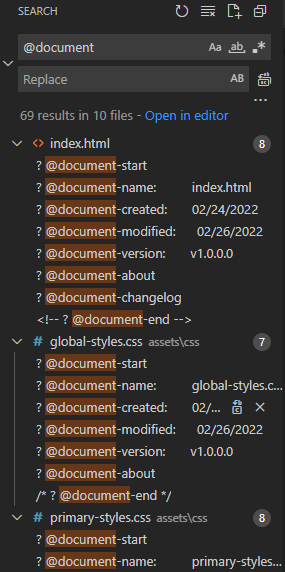
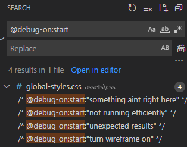

<!-- 
    ? @document-start
    ? @anchor-help
    ==============================
    | ABOUT PROGRAM FILE PREFACE |
    ==================================================================================================================================

    ? @author:                 William J. Horn
    ? @document-name:          anchor-tags.md
    ? @document-created:       02/22/2022
    ? @document-modified:      03/02/2022
    ? @document-version:       N/A

    ==================================================================================================================================
 -->

# Anchor Tags

Within each program file you may see anchor tags (denoted by `@ anchor` or `@ anchor:...`). These are commented-out sections of text that represent some significance in the file. They represent a specific category in which that section of code falls under, such as if there was a bug in your code you could comment `@ bug:start` above it and search for it again later.

## Using Anchor Tags

Aside from anchor tag comments indicating some significant categorical information, their primary intention is to allow for a line (or block) of code to be searched for with your text editor's search function:

 

This can be really useful in large projects where you want to mark certain sections of code by category and the search for that category later on. Specific tags such as `@ bug:start` and `@ debug-on:start` are especially useful as they are sections of code you will often want to revisit and keep track of:

# Summary

[**Original/Updated Source**](https://github.com/william-horn/my-coding-conventions/blob/main/document-conventions/anchor-tags.txt)