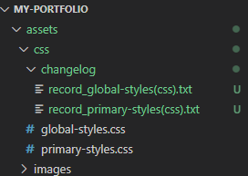
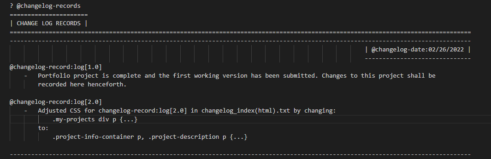
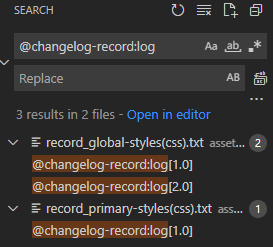

<!-- 
? @document-start
? @changelog-help
=====================
| CHANGE LOG SYSTEM |
==================================================================================================================================

? @author:                 William J. Horn
? @document-name:          about-changelog.md
? @document-created:       02/19/2022
? @document-modified:      03/02/2022
? @document-version:       N/A

==================================================================================================================================
 -->

 # Changelog System

The internal changelog system is nothing more than an organizational tool. It is a system of text files that the developer can read or write to _manually_ during development.

## How Does it Work?

The changelog system is simply just a bunch of text files holding information about the changes made to a program. These text files are stored in `changelog` folders that can be found within the same directory as the program file.

**VSCode Example:**

 

Inside each of those _"record\_\<filename>-(filetype).txt"_ files you see in the `changelog` folder stores plain text logging changes made to the program file it represents. Those are the "changelog record" or "change record" files. The contents of these text files should look something like this:

 

The format of the change record text content was designed with a text editor search feature in mind. Each change log written within the change record text file is prefixed with `@changelog-record:log[...]`. This is so the developer can use their text editor's search feature to navigate to a specific change log, or just simply search for `@changelog-record:log` to see a list of all change record files.

**VSCode Example:**

 

This provides a convenient method for searching through changelog records within your editor for big projects. 

# Summary

(More to come soon)

[**Original/Updated Source**](https://github.com/william-horn/my-coding-conventions/blob/develop/document-conventions/changelog-help.txt)