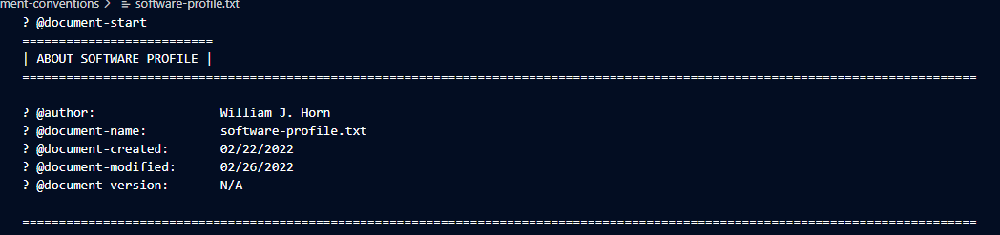
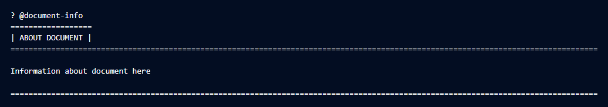
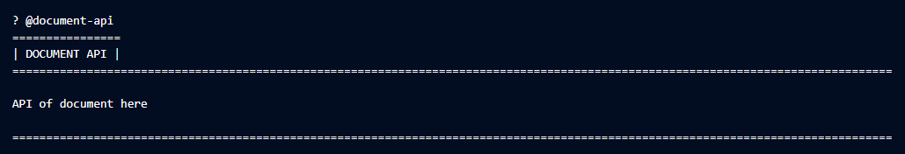
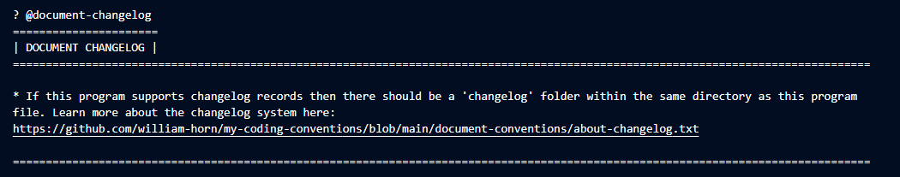
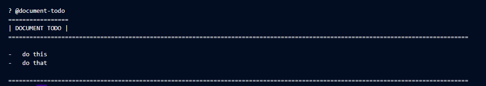

<!-- 
    ? @document-start
    ? @software-profile
    ==============================
    | ABOUT PROGRAM FILE PREFACE |
    ==================================================================================================================================

    ? @author:                 William J. Horn
    ? @document-name:          software-profile.md
    ? @document-created:       02/22/2022
    ? @document-modified:      02/27/2022
    ? @document-version:       N/A

    ==================================================================================================================================
 -->

# Software Profile

The software profile is the big block of commented text at the beginning of all my program files. This is to ensure clarity of the program's purpose, function, issues, resources, contributors, changes, and more. The profile section is categorized in the following ways:

## **Heading**

The heading describes the primary information about the document. The heading name should be a short summary of the program or project name, followed by the information below:

* **Author**
    - Who wrote the program (including those who contributed)
* **File Name**
    - The name of the file (with the file type extension included)
* **Creation Date**
    - The date of the document's creation
* **Last Modified**
    - The date of the document's last modification (does not necessarily correlate to the version number of the program)
* **Version Number**
    - The currently released version of the program

#
Appearance in file:

## **Document Information**

The document information is where all verbose details of the document are written. Such information includes but is not limited to:

* Lengthy description about the document
* License/Copyright/Legal information about the document
* Contributors and their contributions

Appearance in file:

## **Document API**
 

<strong style="color: orange">⚠️ This profile heading will only exist IF: <ul><li>The document therein is a library, class, module, or the likes thereof.</li><li>The document uses external libraries that should be further explained.</li></ul></strong>

The document API is where all information about the program's interface should reside. This should include a list of all API tools the program has to offer, and some code examples of how to use them.

If the program is not a library, this section may also include information about any external libraries imported to the program if further documentation is warranted.

Appearance in file:

## **Document Changelog**

<strong style="color: orange">⚠️ This profile heading will only exist IF: <ul><li>The developer deems keeping a changelog of the file necessary.</li></ul></strong>

The document changelog is where a reference to the changelog help repository is located. Nothing more should be in this category. [Read more about changelog here.](https://github.com/william-horn/my-coding-conventions/blob/main/document-conventions/changelog.txt)

Appearance in file:

## **Document Todo**

<strong style="color: orange">⚠️ This profile heading will only exist IF: <ul><li>The developer is interested in writing down future goals</li></ul></strong>

The document todo section is a temporary list of relevant goals that the developer(s) should meet. This could be for a new upcoming release, to log significant bugs or issues, or any reminder to do something.

Appearance in file:

# Summary

This profile document is written purely just to help me organize and maintain clean code. It is subject to change and most likely will several times, but should follow the same overall structure.

[**Original/Updated Source**](https://github.com/william-horn/my-coding-conventions/blob/main/document-conventions/software-profile.txt)